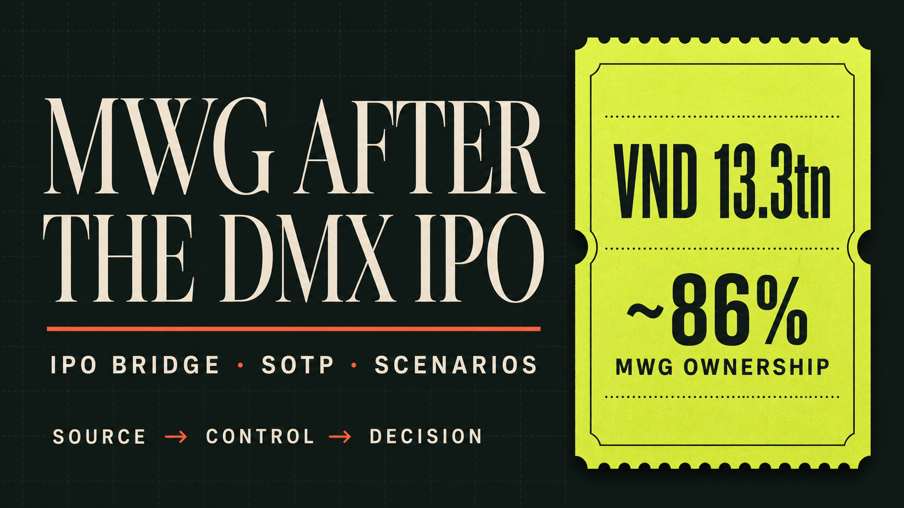

# MWG–DMX IPO Valuation Lab

[](https://github.com/susayold/mwg-dmx-ipo-valuation/actions/workflows/ci.yml)
[](https://susayold.github.io/mwg-dmx-ipo-valuation/)
[](LICENSE)

An end-to-end financial-analysis portfolio project covering the completed Điện Máy Xanh (DMX) IPO, post-transaction corporate perimeter, financial-statement normalization and a scenario-based sum-of-the-parts valuation of Mobile World Investment Corporation (MWG).

> **Tóm tắt:** Dự án biến nguồn công bố chính thức thành dữ liệu tài chính có thể truy vết, đối chiếu kết quả IPO thực tế, khóa các lỗi double-count trong DCF/SOTP và đóng gói kết quả thành Excel model, investment memo, validation artifacts và website tương tác.

**Data cut-off:** 13 July 2026 · **Currency:** VND billion unless stated otherwise · **Status:** Independent analyst work sample; not investment advice.



## Recruiter quick tour

| Start here | What it demonstrates |
| --- | --- |
| [Live portfolio](https://susayold.github.io/mwg-dmx-ipo-valuation/) | Research narrative and interactive Bear/Base/Bull SOTP |
| [Excel financial model](model/MWG_DMX_IPO_SOTP_Model.xlsx) | IPO bridge, actuals, management outlook, FCFF DCF, SOTP, sensitivities and QA |
| [Research memo](reports/RESEARCH_REPORT.md) | Long-form investment analysis and limitations |
| [Source registry](data/source_registry.csv) | 29 official-source records with scope, audit status, URL and SHA-256 |
| [Curated financial facts](data/processed/dmx_q1_2026_financial_facts.csv) | 210 source-tagged Q1 facts from allowlisted statements |
| [Validation report](public/downloads/validation_report.html) | Accounting and data-quality checks |
| [Analytics engine](analytics/) | Python/SQLite normalization, ratios, validation and valuation logic |

The root [`index.html`](index.html) is intentionally standalone: it opens directly without Node.js or Python and is the exact entry point deployed by GitHub Pages.

## Why this case?

The completed DMX primary offering creates a visible transaction anchor inside MWG, but it does not answer whether MWG is attractively valued. The post-IPO question is:

```text
MWG equity value
= value of MWG's DMX stake
+ value of the non-DMX stub
+ parent-level adjustments
```

This case combines four problems normally handled separately:

1. Normalize financial statements while preserving source lineage.
2. Reconcile planned offer terms with the actual transaction close.
3. Prove the post-restructuring perimeter before applying DCF/SOTP.
4. Productize the analysis as auditable code, Excel, memo and web outputs.

The key perimeter control is EraBlue: the equity-accounted joint venture sits inside DMX and is valued once. It is never added again to the MWG stub.

## Verified transaction snapshot

| Metric | Actual close |
| --- | ---: |
| IPO offer price | VND 80,000/share |
| Successfully issued shares | 166,438,500 |
| Post-offer shares | 1,267,722,000 |
| Gross proceeds | VND 13,315.080bn |
| Post-money value at the offer price | VND 101,417.760bn |
| MWG ownership disclosure | “Nearly 86%” |

The model uses the final allocation, not the planned 179.5 million-share maximum. The 13.1 million unallocated shares are excluded from post-offer capital. “Nearly 86%” remains a rounded disclosure; calculations labelled `~86%` are model approximations, not an exact shareholder-register result.

## Operating evidence

| Q1 metric | 2025 | 2026 | Change |
| --- | ---: | ---: | ---: |
| Revenue | 25,153.56 | 32,541.95 | +29.4% |
| Gross profit | 4,526.17 | 6,241.22 | +37.9% |
| Gross margin | 17.99% | 19.18% | +118 bps |
| NPAT | 1,478.38 | 2,218.57 | +50.1% |
| CFO | 2,477.05 | 863.69 | CFO/NPAT = 38.9% |

The earnings signal is constructive, but cash conversion is the main watchpoint. The analysis therefore reads margin expansion together with inventory, supplier funding, receivables and seasonality rather than treating NPAT growth as a complete conclusion.

The issuer's six-month update reported VND 65,279bn of revenue, 32% same-store sales growth and 53% completion of annual revenue guidance. These figures remain labelled as an unaudited issuer operating update, not a complete H1 financial-statement set.

## Valuation framework

The public case deliberately separates:

- **Official actuals:** reported figures are not altered to fit a forecast.
- **Issuer operating updates:** LFL operating evidence is kept separate from statutory statements.
- **Management projections:** the 2026–2030 path is not relabelled as an analyst forecast.
- **Analyst assumptions:** WACC, terminal growth, multiples, stub values and discounts remain editable scenarios.

The Excel model includes:

- a planned-versus-actual IPO bridge;
- Q1 reported income-statement, balance-sheet and cash-flow facts;
- management revenue, NPAT and gross-margin references;
- an illustrative FCFF DCF with mid-year convention;
- an equity-level MWG SOTP;
- Bear/Base/Bull cases and sensitivity matrices;
- 20 QA/publication controls.

No target price, upside/downside or investment rating is published because same-date market price, exact diluted share count and exact post-IPO ownership are not all verified on one basis.

## Data architecture

```text
DMX / MWG / SSC official disclosures
                │
                ▼
data/source_registry.csv
URL · period · scope · audit status · retrieval time · SHA-256
                │
                ├── data/raw/                         local only; git-ignored
                │
                ▼
Allowlisted Excel extractor
Balance Sheet · Income Statement · Cash Flow Statement
                │
                ▼
Source-tagged curated facts
                │
                ├── accounting and lineage validation
                ├── ratios and SQLite audit trail
                ├── DCF/SOTP scenario engine
                ├── generated Excel and research artifacts
                └── standalone and React web presentations
```

Core controls include:

- assets = liabilities + equity;
- revenue + signed COGS = gross profit;
- opening cash + movements + FX = ending cash;
- duplicate natural keys and missing source references;
- consolidated versus separate-statement scope;
- IPO share/proceeds identities;
- unique SOTP double-count buckets;
- WACC greater than terminal growth;
- IPO cash included once;
- market-conclusion publication gate.

## Repository structure

```text
.
├── index.html                    # GitHub Pages entry point and interactive SOTP
├── README.md                     # Project overview and reproduction guide
├── LICENSE                       # MIT license for original code/content
├── CONTRIBUTING.md               # Source, model and review conventions
├── .github/workflows/
│   ├── ci.yml                    # Web/Python tests and artifact rebuild
│   └── pages.yml                 # Standalone portfolio deployment
├── app/                          # React/Vinext research application
│   ├── components/               # Interactive valuation component
│   └── data/                     # Typed public case data
├── analytics/                    # Installable Python analytics package
│   ├── src/                      # Validation, ratios, database and valuation
│   ├── tests/                    # 19 unit/integration tests
│   ├── data/sample/              # Clearly labelled synthetic fixtures
│   └── sql/                      # SQLite schema
├── data/
│   ├── source_registry.csv       # Source manifest and document hashes
│   └── processed/                # Curated source-tagged financial facts
├── docs/                         # Data scope, methodology and model contract
├── model/                        # Generated auditable Excel workbook
├── public/
│   ├── downloads/                # Model, memo, facts and validation artifacts
│   ├── favicon.svg
│   └── og.png
├── reports/                      # Long-form research memo
├── scripts/
│   ├── fetch_sources.py          # HTTPS download and SHA-256 verification
│   ├── build_financial_model.py  # Reproducible Excel builder
│   └── build_reports.py          # PDF/HTML/manifest builder
├── tests/                        # Rendered and standalone web tests
└── worker/                       # Cloudflare-compatible React entry point
```

The main analysis-facing folders contain short README files describing their public purpose and review path.

## Reproduce locally

### Requirements

- Node.js `>=22.13.0`
- Python `>=3.11` (CI uses Python 3.12)

### Open the portfolio without installing anything

Open [`index.html`](index.html) in a browser.

### Build and test the React application

```bash
npm ci
npm test
npm run lint
```

### Run the analytics engine

```bash
python -m venv .venv
# PowerShell: .venv\Scripts\Activate.ps1
# macOS/Linux: source .venv/bin/activate

python -m pip install --upgrade pip
python -m pip install -e "analytics[xlsx]"
python -m unittest discover -s analytics/tests -v
```

### Validate the source-download plan

```bash
python scripts/fetch_sources.py --dry-run
```

The downloader accepts HTTPS only, writes only inside ignored `data/raw/`, enforces a size limit and publishes a file only after its SHA-256 matches the registry. Review the source owner's terms before downloading or using any filing.

### Rebuild the Excel model and reports

```bash
python -m pip install -r requirements-artifacts.txt
python scripts/build_financial_model.py
python scripts/build_reports.py
```

Generated outputs:

- `model/MWG_DMX_IPO_SOTP_Model.xlsx`
- `public/downloads/MWG_DMX_IPO_SOTP_Model.xlsx`
- `public/downloads/Investment_Memo_EN.pdf`
- `public/downloads/validation_report.html`
- `public/downloads/dmx_q1_2026_financial_facts.csv`
- `public/downloads/artifacts_manifest.json`

## Tests and continuous integration

The current public suite contains:

- **19 Python tests** for extraction boundaries, validation, ratios, SQLite pipeline and valuation;
- **4 web/static tests** for rendered research content, standalone JavaScript and local artifact links;
- workbook build checks for required sheets, formula integrity, comments and external links;
- report validation and SHA-256 artifact manifests.

GitHub Actions runs tests, linting, source-plan validation, model/report rebuild and required-artifact checks. A separate Pages workflow publishes only the recruiter-facing HTML/assets/downloads.

## Known limitations

- Data is frozen at 13 July 2026 and must be refreshed for later use.
- Exact MWG ownership is not inferred from the rounded “nearly 86%” announcement.
- The 2026–2030 figures are management projections, not independent forecasts.
- The public case does not claim a fully integrated three-statement segment forecast.
- Non-DMX businesses need deeper standalone forecasts and same-date peer inputs.
- The valuation outputs are scenario illustrations, not target prices or recommendations.
- Raw issuer filings are intentionally excluded from Git and must be obtained from their official owners.

## Primary official sources

- [DMX Investor Relations — reports](https://www.dmx.vn/eng/reports)
- [DMX — completed IPO announcement](https://www.dmx.vn/eng/news/dien-may-xanh-completes-landmark-ipo-raising-more-than-vnd-13-315-billion-and-lifting-charter-capital-to-vnd-12-677-billion-5002485)
- [DMX — offering documents and prospectus](https://www.dmx.vn/cong-bo-thong-tin/cbtt-thong-bao-chao-ban-co-phieu-ra-cong-chung-va-cac-tai-lieu-lien-quan-cua-ctcp-dau-tu-dien-may-xanh-5005813)
- [MWG Investor Relations — reports](https://mwg.vn/bao-cao)
- [State Securities Commission — IPO result notice](https://ssc.gov.vn/webcenter/portal/ubck/pages_r/l/chitit?dDocName=APPSSCGOVVN1620168640)

The complete inventory, including direct URLs, periods, scope, audit status, retrieval timestamps, size and SHA-256, is in [`data/source_registry.csv`](data/source_registry.csv).

## License and data rights

Original source code and original repository content are released under the [MIT License](LICENSE). The MIT License does **not** relicense MWG, DMX, SSC or other third-party filings, trademarks, reports or data.

Raw filings remain outside Git. Users are responsible for obtaining documents from official sources and complying with the owners' terms and applicable law before reuse or redistribution. See [`docs/data_scope.md`](docs/data_scope.md).
